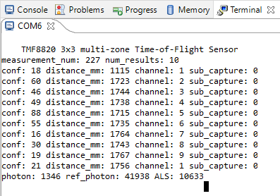
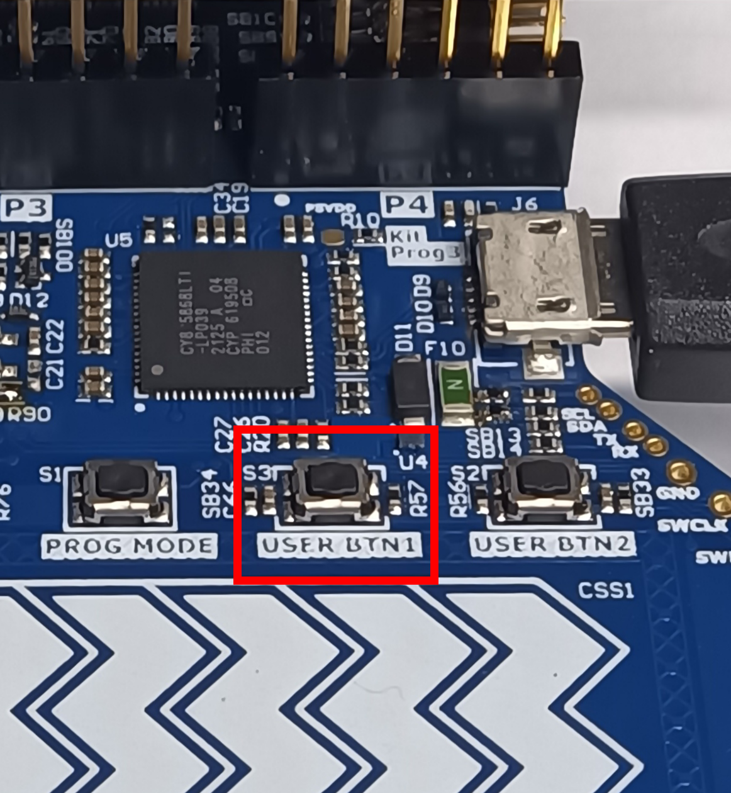
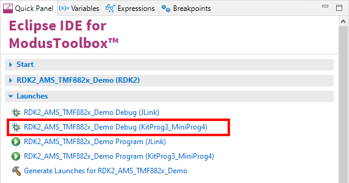

# RDK2 ams MS-TMF882x-01 Code Example

Rutronik Development Kit Programmable System-on-Chip CY8C6245AZI-S3D72 "RDK2 ams MS-TMF882x-01" Code Example. 

This code example demonstrates the ams ToF sensor's TMF8820 capabilities.

 

### Using the code example with a ModusToolbox IDE:

1. Import the project: **File** > **Import...** > **General** > **Existing Projects into Workspace** > **Next**.
2. Select the directory where **"RDK2_AMS_TMF882x_Demo"** resides and click  **Finish**.
3. Select and build the project **Project ** > **Build Project**.

### Operation

The firmware example uses KitProg3 Debug UART for the debug output. The results are read from the sensor and are printed on the terminal window. The distance of every sensor is represented in millimeters.




The additional debugging information can be enabled or disabled by modifying the code in a "tmf882x_example_simple.c" file. 

```
/**************************************************************************
*
* DISABLE debug logging in the TMF882X core driver
*
*************************************************************************/
if (g_core_drv_logging > 1)
tmf882x_set_debug(&tof, false);
```


The application always waits for the "**USER-BTN1**" to be pressed after the start-up of the system. Please press the button "**USER-BTN1**" on the RDK2 board to start or to stop the measurements of the TMF8820.



### Debugging

If you successfully have imported the example, the debugging configurations are already prepared to be used with a the KitProg3, MiniProg4, or J-link. Open the ModusToolbox perspective and find the Quick Panel. Click on the desired debug launch configuration and wait for the programming to  complete and debugging process to start.



## Legal Disclaimer

The evaluation board including the software is for testing purposes only and, because it has limited functions and limited resilience, is not suitable for permanent use under real conditions. If the evaluation board is nevertheless used under real conditions, this is done at one’s responsibility; any liability of Rutronik is insofar excluded. 


