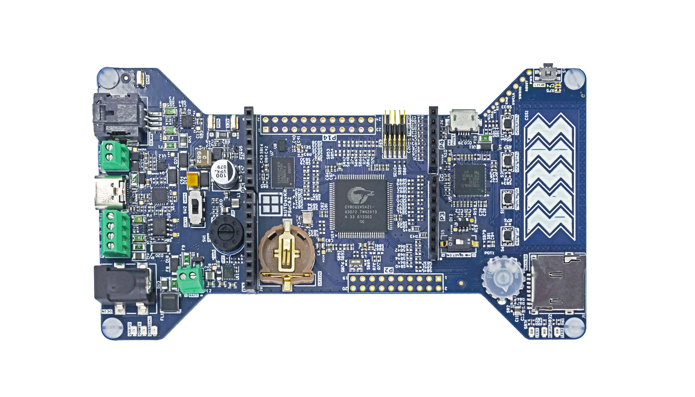

# RDK2 BSP

## Overview

First choice for the RDK2 was Infineon’s microcontroller PSoC™ 62. It is built on an ultra low-power platform (40-nm) and combines an Arm® Cortex™-M4 and Arm Cortex-M0+ CPUs with low-power Flash technology, programmable digital and analog resources, and offering high- performing CAPSENSE™ technology. Built around the PSoC™ 62 are best fitting standard components in order to offer the highest level of benefit and access to all the comprising features of the microcontroller for customers.

## Features

| Features:               | **Description:**                                             |
| ----------------------- | ------------------------------------------------------------ |
| DC Connector:           | 5.5X2.1mm ADAM TECH ADC-028-1-T/R-PA10T connector providing power to the whole board. 6V to 20V DC is applicable. |
| RS485 Terminal:         | RS485 is a common communications interface in industrial environments, equipped with a SP3078EEN-L/TR driver from MaxLinear. |
| Li-ION Charger:         | nPM1100 from Nordic Semiconductor. Very common charger used for designing IoT and other portable devices. |
| Rotary Switch:          | Compact and versatile switch from C&K for power sources selection. Especially convenient when it is needed to select a single option from the up to seven inputs. |
| CR1220 Battery Socket:  | The Keystone CR1220 coin battery holder enables developers to have the whole system running at low power from a coin battery or simply keeps the RTC Clock powered when the MCU is shut down. |
| CY8C6245AZI-S3D72:      | Ultra-low-power high-performance microcontroller.            |
| Arduino RESET Switch:   | The DIP switch from DIPTRONICS enables to disconnect of the RESET signal from the Arduino socket. This is necessary in some cases because offline shields may interfere with the RESET signal and prevent the microcontroller from starting up. |
| Potentiometer:          | Tiny but useful potentiometer-trimmer with a knob from PIHER. It is used for testing the ADC peripheral or even adjusting the mounted Arduino shield. |
| Micro SD Card Socket:   | High-quality ADAM TECH socket for constant data logging or removable/portable large amounts of data. |
| USB Type-C:             | Comes with onboard stand-alone power delivery controller CYPD3177 from Infineon and Type-C connector from JAE. Enhances power supply options for the development platform. Also serves as an innovative demonstration purpose for particular clients who need to remove barrel DC connectors from existing designs. |
| Sink Output Terminal:   | Small terminal connector from SAURO is used to connect a load and supply it with power from the power source connected to a USB Type-C connector. |
| CAN FD Terminal:        | Minitek MicrospaceTM connector in combination with CAN FD driver TLE9251VLE and PSoC™ 6245 controller with integrated CAN FD peripheral provides a development-ready solution for CAN/CAN FD applications. |
| Current Monitor:        | Test point contacts from Keystone enable current measurement using an oscilloscope or multimeter. For ultra-low-power applications additional specialized equipment is available. |
| SEMPER™ NOR Flash :     | A 512MBit SEMPER™ NOR Flash connected with microcontroller QSPI can be used to store large amounts of program data or even the firmware that may run directly from it. |
| PSRAM:                  | The AP Memory APS6404L-3SQR-ZR PSRAM is connected with a microcontroller via QSPI interface and is dedicated for the applications where large amounts of RAM are needed having low power consumption in mind. |
| 10-pin ARM SWD:         | Amphenol connector used for connecting third-party debuggers as J-Ling etc. |
| KitProg3 via Micro USB: | ADAM TECH micro USB connector is used to interface the KitProg3 on-board-debugger. The KitProg3 Debugger is based on a CY8C5868LTI-LP039 microcontroller. |
| CAPSENSE™:              | Highlighted superior feature of the PSoC™ MCUs.              |
| The Buttons:            | High quality and durability Al buttons from Panasonic.       |
| The Power Management:   | Based on Diodes and ROHM products. The ROHM Buck/Boost BD83070GWL-E2 controller enables the board to be powered from the Li-ION battery. The Diodes AP63357DV-7 Buck high-efficiency controller allows having a high-power supply providing developers with up to 3.5A of current at 5V. |

## Legal Disclaimer

The evaluation board including the software is for testing purposes only and, because it has limited functions and limited resilience, is not suitable for permanent use under real conditions. If the evaluation board is nevertheless used under real conditions, this is done at one’s responsibility; any liability of Rutronik is insofar excluded. 

